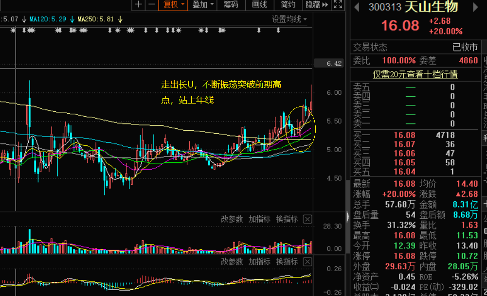
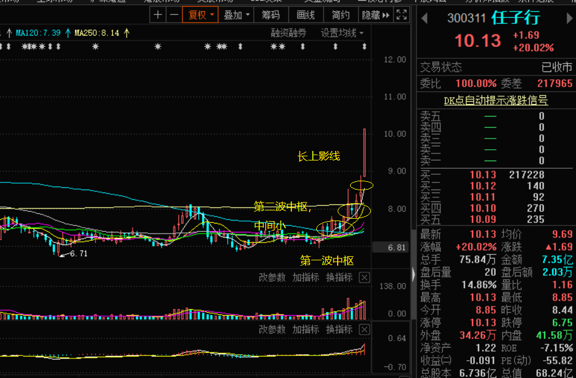
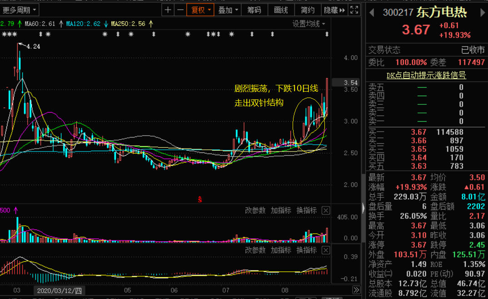

# first_lianghua

## 基础功能

### 文件下载

* 所有数据放在文件夹内，以sockt code名字为文件名的csv文件
  > 需要确定文件code列表是从哪里下载，一个是 [baostock](http://baostock.com/baostock/index.php/Python_API%E6%96%87%E6%A1%A3)
  >> import baostock as bs 
  >> lg = bs.login()
    rs = bs.query_all_stock('2020-08-20')
    data_list = []
    while (rs.error_code == '0') & rs.next():
        data_list.append(rs.get_row_data())
    result = pd.DataFrame(data_list, columns=rs.fields)
    print("total size: ", len(data_list))
    result.to_csv("/Users/liujinf/sourcecode/tensorflow/venv/tensor_code/pycharmTest/socket/socketids.csv", encoding='utf8', index=False)
    bs.logout()

  > tushare, [stock_basic](https://tushare.pro/document/2?doc_id=25)

* 定时更新数据，主要包括基本的日线数据
  > baostock, query_history_k_data_plus
  > tushare, [daily](https://tushare.pro/document/2?doc_id=27)
  > 数据更新之后，需要更新csv文件的内容
  > 考虑将均线以及相关参数放如到文件内，减少计算的时候的运算  

* 设计算法
  > 初始可以简单点，只做选择，并且输出K线图，可以考虑输出多张图放在一个plt上

* 算法
  > buymethod1
    
  
  > buymethod2
    

  > buymethod3
    
      
  > buymethod4

  > buymethod5

  > buymethon6